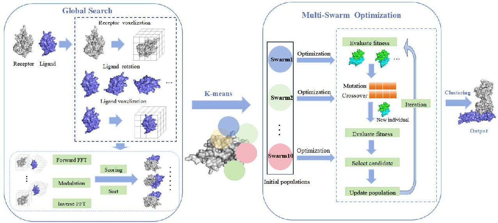

# Feshdock: A Divide-and-Conquer Protein--Protein Complex Conformation Prediction Algorithm

## 1. Synopsis

Feshdock is focused on protein-protein docking method based on the Fast Fourier Transform (FFT) and evolutionary computation algorithms. Feshdock leverages the FFT to globally scan potential binding positions, which are then partitioned into multiple clusters using the K-means method. These clusters are locally optimized by a swarm intelligence algorithm in a divide-and-conquer manner, accompanied by an anisotropic network model considering protein flexibility. Finally, hierarchical clustering is employed to determine the final candidate complex conformations.

## 2. Installation

Feshdock is recommended to be compiled and executed in the Linux  OS, it has not been tested on Microsoft Windows and may bave some issues.

Create a virtual environment and install some necessary dependencies first:

* `conda create -n feshdock python=3.9` 

* `conda activate feshdock`

Feshdock has following important dependencies:

* biopython==1.79
* Cython==3.0.10
* freesasa==2.2.0
* nvidia-nccl-cu12==2.22.3
* pyFFTW==0.13.1
* scikit-learn==0.24.1
* transforms3d==0.4.1

all dependencies are listed in the `requirements.txt` (`pip install -r requirements.txt`).

Then compile the Scoring module. Enter the directory `feshdock/scoring/dfire/cython` and execute:

* `cd feshdock/scoring/dfire/cython`

* `python setup.py build_ext --inplace`

Remember that all executables need to be authorized by `chmod +x [executable file]`.

## 3. Docking

Place the receptor protein, ligand protein, and native comple structure files to be docked in the `data/` directory, then execute the following command for docking:

* `python run_feshdock.py`

After docking, result will be saved in `data/fina_models/`.

